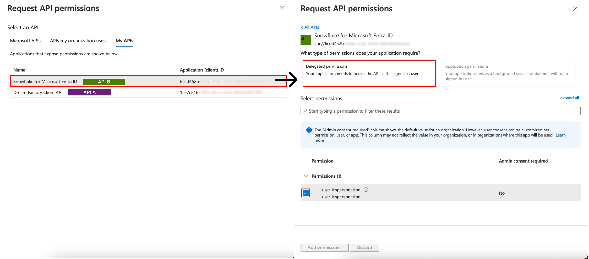

# df-azure-ad
Azure Active Directory Support for DreamFactory

## Authenticating with Azure Active Directory OAuth 2.0 with the On-Behalf-Of flow
With the standard Azure AD OAuth 2.0 authentication flow, you can authenticate your Dream Factory API directly with your Azure AD service. The On-Behalf-Of (OBO) authentication flow allows your Dream Factory API to make requests to your Azure AD service on behalf of the currently authenticated user, instead of authorizing your Dream Factory API itself.

This is achieved by creating a new Azure AD service to represent your Dream Factory API, and authorizing this new service as a Client API for your existing Azure AD service. Your users can authenticate with this new service in the same way as usual, with their SSO credentials. Once this authentication is successfully completed, Dream Factory can request an access token for your target Azure AD service, on behalf of the authenticated user.

This process can be demonstrated in this diagram from the Microsoft OBO flow documentation. For the following setup guide, API A is your Dream Factory API, and API B is your existing Azure AD service.

There are a few extra steps required to configure and authorize this new Azure AD service.

First, log in to your dashboard at https://entra.microsoft.com/, go to `Identity -> Applications -> App Registrations` and create a new registration with the single tenant type. You will now have two App Registrations:

After you have created the App Registration for your Client API, go to the App Registration for your existing API (API B). From the Overview page, copy the value for `Application (client) ID` and navigate to `Expose an API`. In the `Application ID URI` field, set a value equal to `api://<your-client-id>`. Then, under `Scopes defined by this API` add a new scope, with the name of `user_impersonation`. Now, under `Authorized client applications`, add a client application, entering the client id of your newly created App Registration for your Client API, and mark your `user_impersonation` scope as authorized. Your configuration should now look like this:

Next, navigate back to the App Registrations, and select the new Client API, API A. Go to the API Permissions tab, and press `Add a Permission`. In the new permission dialog, go to the `My APIs` tab, click on your API B (your existing Azure AD resource). Then, choose `Delegated permissions` and check the box for your previously created `user_impersonation` scope, and press Add Permissions to finish adding the new permission.

The API Permissions tab for your API A should now look like this:

Next, you will need to also configure a scope for API A. Under the `Expose an API` tab for API A, your Client API, configure the Application ID URI in the same `api://<your-client-id>` format as before, and add a new scope, also called `user_impersonation`, except this time you will use the Client ID for API A. You do not need to authorize any client applications for this scope.

Finally, navigate to the `Certificates and secrets` tab of your API A App Resigistration, go to the `Client secrets` tab, and press `New client secret`. When you have created the new client secret, make sure to keep the value somewhere safe, as you will not be able to view it again, and you will need it when configuring your API in DreamFactory.

This completes the Azure AD configuration, and you are ready to create your new Authentication API in the DreamFactory dashboard.

After logging into the Dream Factory dashboard, go to Security -> Authentication, and create a new Authentication API with the Service Type of `Azure Active Directory OAuth 2.0 On-Behalf-Of`, and configure it as shown below. You will need to add the Client ID of API A, the Client Secret that you added for API A, as well as the scopes that you created for each API. Your Redirect URL will be specific to your own use case, but must match one of the redirect URLs configured in the Azure AD dashboard under Authentication for your App Registrations. The Tenant ID can be found on the Overview tab of either App Registration, and should be the same between both API A and API B.

You should now be able to authenticate with your OAuth OBO service in the same way that you were previously able to with your standard Azure AD OAuth service.